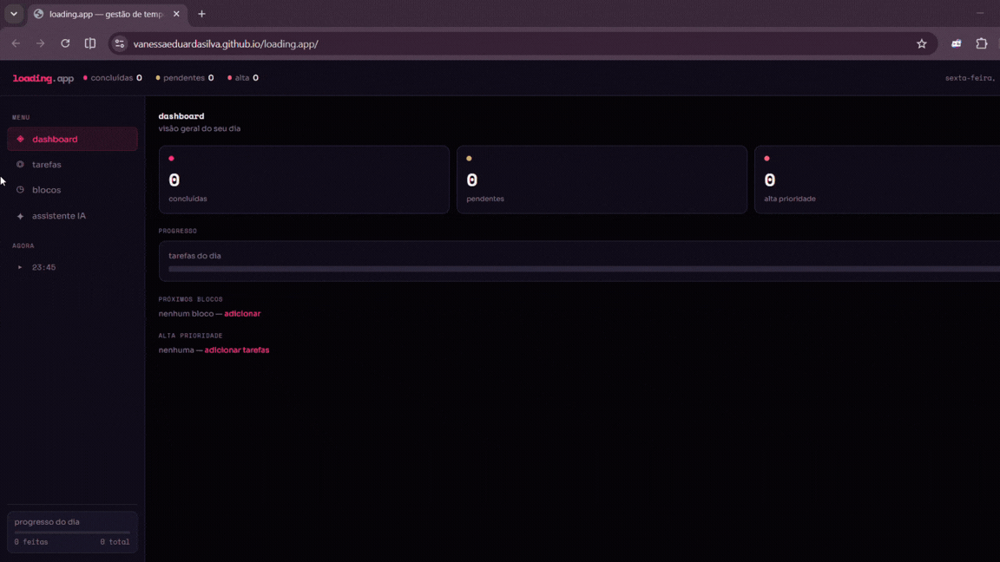

#  Loading.app

Eu sempre tive dificuldade em organizar meus estudos e tarefas do dia a dia. Notas e planilhas até ajudavam, mas não eram práticas no celular e não me davam consistência.

Por isso criei o **Loading.app**, um projeto pessoal de produtividade que junta organização de tarefas com uma assistente de IA para me ajudar a manter o foco e priorizar o que realmente importa no dia.

A ideia é transformar a rotina em algo mais leve, onde eu posso conversar com o sistema e receber ajuda para organizar minhas tarefas.

⚠️ A parte de IA ainda está em evolução.

##  Funcionalidades

- Organização de tarefas do dia  
- Assistente de IA para apoio e planejamento  
- Respostas baseadas no contexto do usuário  
- API backend simples  
- Estrutura pronta para evolução  

##  Tecnologias

- Python  
- Flask  
- API REST  
- Inteligência Artificial (LLMs como Claude/Gemini)  
- Git e GitHub  
- Railway (deploy em cloud)  

## O que aprendi

Esse projeto foi importante para entender como funciona um backend de verdade e como integrar inteligência artificial em uma aplicação real.

Também aprendi sobre APIs, estrutura de servidor, deploy em cloud e como pensar um projeto como produto, não só como código.

##  Visão do projeto

Um copiloto de produtividade pessoal simples, que vai evoluindo conforme eu aprendo mais sobre backend e IA.

##  Demonstração

Aqui está uma demonstração rápida do funcionamento do Loading.app:

